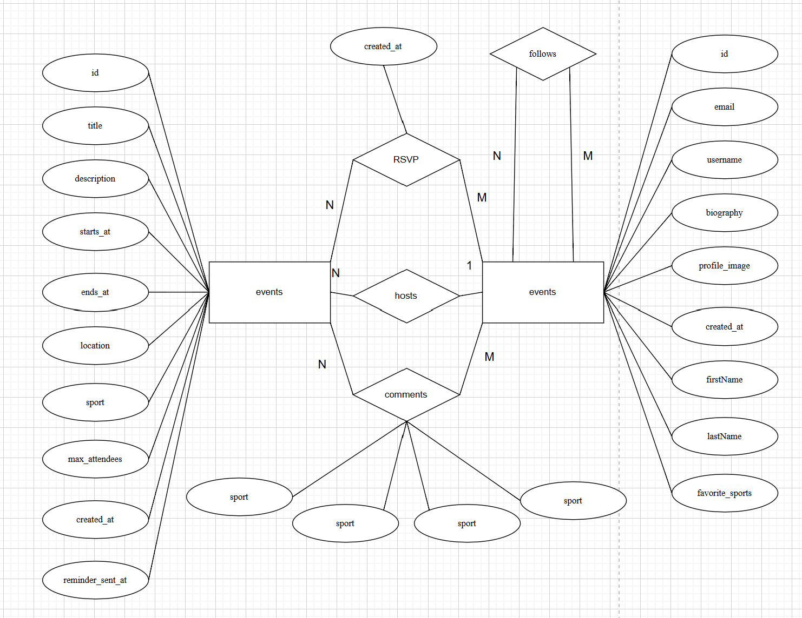
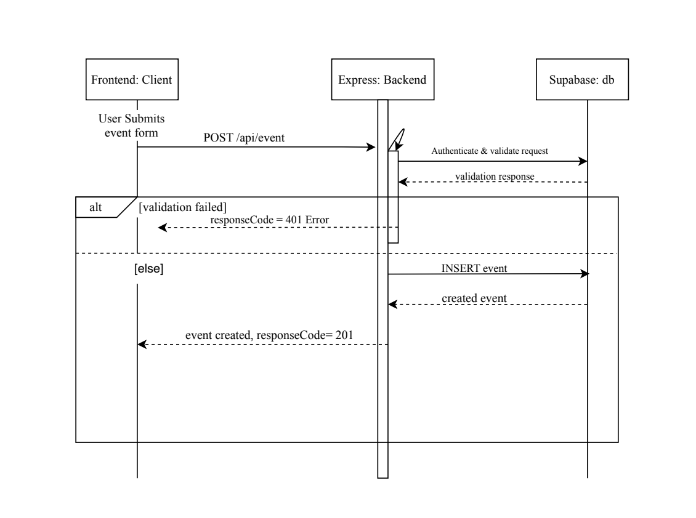

# Sports Connect

React (Vite) frontend + Express backend, backed by Supabase. Run both locally with one command.

## Diagrams

Entity-Relationship Diagram of Database

Description: This diagram shows our database table relationships.

Sequence Diagram of Create Event

Description: This diagram shows the request sequence that our program follows when a user tries to create an event.

## Structure

```
backend/    Express API (ESM) — routes under /api (auth, users, events), Supabase client
frontend/   React + Vite app — pages (feed, create-event, profile, auth), proxies /api to backend
package.json  Root scripts that install and run both apps together
```

## Prerequisites

- Node.js 18+ and npm
- A Supabase project (free tier)

## Run locally

```bash
# 1. Install dependencies (root, backend, frontend)
npm run install:all

# 2. Add your Supabase keys
cp backend/.env.example backend/.env      # fill in SUPABASE_URL + SUPABASE_SECRET_KEY
cp frontend/.env.example frontend/.env    # fill in VITE_SUPABASE_URL + VITE_SUPABASE_PUBLISHABLE_KEY

# 3. Start the app
npm run dev          # backend + frontend together (one terminal)
```

Or run them in separate terminals for cleaner logs:

```bash
npm run dev:backend  # terminal 1
npm run dev:frontend # terminal 2
```

- Frontend: <http://localhost:5173>
- Backend: <http://localhost:3001> (`/api/*` is proxied from the frontend)

Verify the backend: `curl http://localhost:3001/api/health` → `{"status":"ok"}`

> Without Supabase keys the app still starts, but every data route returns `503`.
